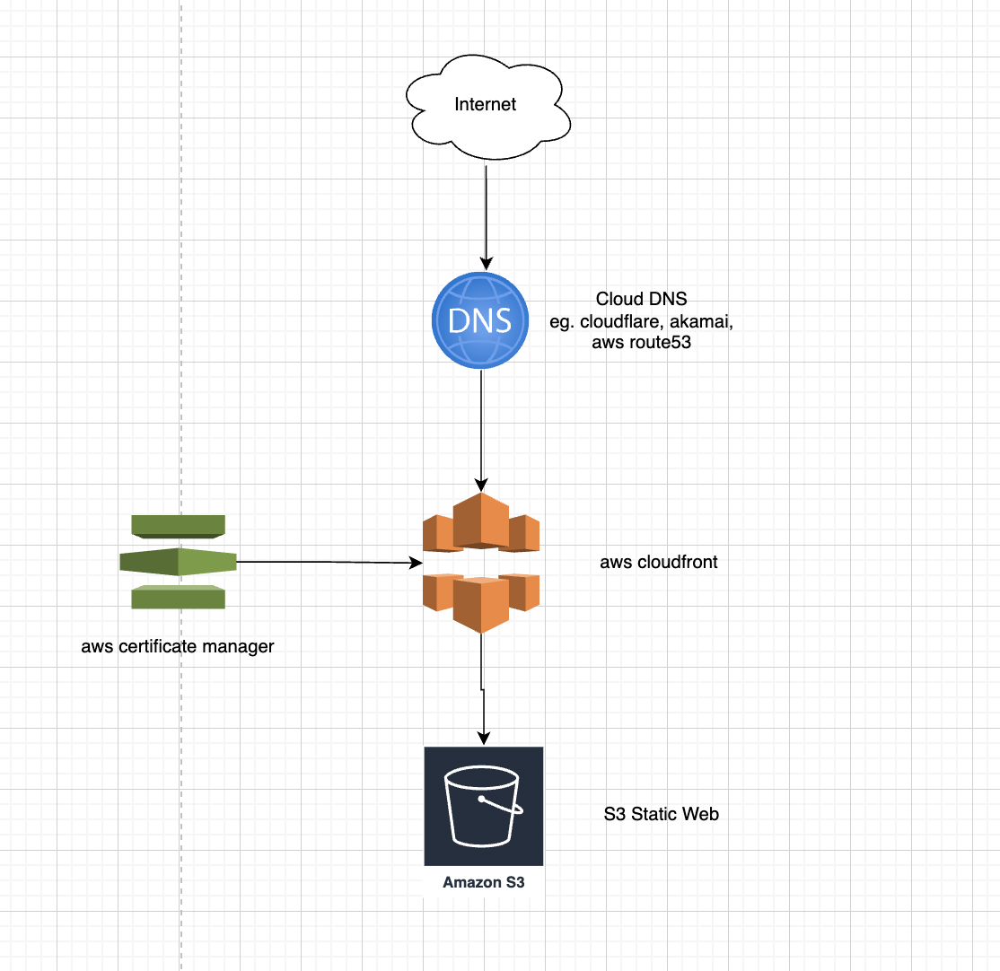
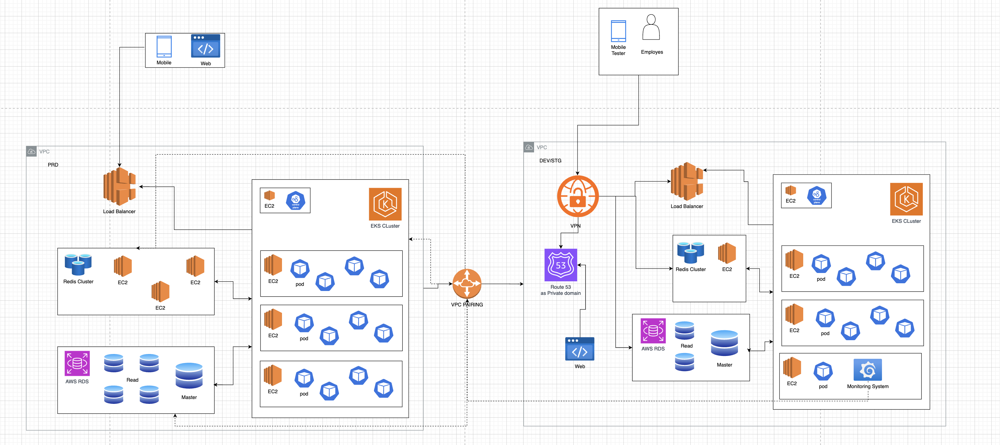

Provide your solution here:

# Frontend architecture

- user from internet request to cloud DNS plaform
- from there we implement cloudfront as a cdn and certificate manager to genereate and save the SSL certificate
- and we store all of staic web in the s3 bucket

# Backend architecture

We saperate the Production and other env

## Dev/Stg

- internal user/empoyies connect using VPN, it make external user can access our infra
- inside the vpc we have route53 as private domain this will by internal services and employes
- the dev/stg have lower specs to reduce cost
- we use single monitoring system for all env and store it in the dev/stg, we dont want any distrubtion in the our core business
- dev/stg and prd vpc are connected by vpc peering but dev/stg infra exclude VPN cant access directly access VPC prd
- from VPN we can control employes who has access or can access the prd infra
- all of the backend services using microservices and run in the kubernetes engine
- with that we can use autoscaling from kubernetes base on cpu and memory usage

## Prd

- same as dev but for production we have more higher resources
- the monitoring system can monitored the recources and logging the prd
- but only some people have access to prd infra

NOTE: personaly i dont like to use the SaaS from the cloud platfrom except that have same behavior,
that why rather than use database model offer by aws i use RDS and redis it mean no vendor locking
